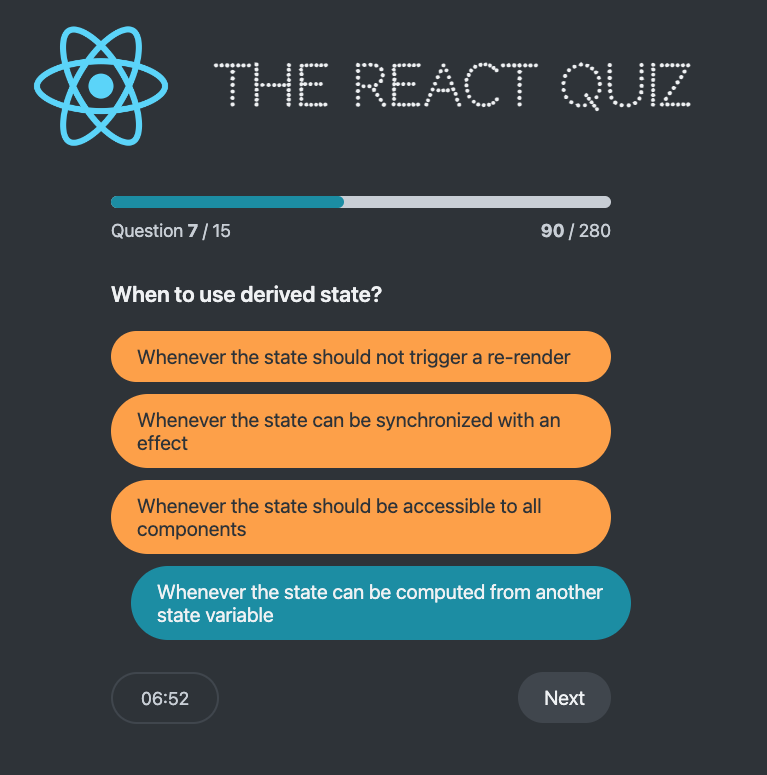

# React Quiz

  

## About The Project

The React Quiz app is a fun and informative web application designed to test and expand your knowledge of React and its ecosystem. Through a series of carefully crafted questions ranging from basics to advanced concepts, users can gauge their understanding of React, learn new aspects, and solidify their knowledge in a fun, interactive way.

### Quiz Features

- **Diverse Question Set**: Features a wide range of questions covering fundamental and advanced topics in React.
- **Immediate Feedback**: Receive instant feedback on your answers to understand your strengths and areas for improvement.
- **Points System**: Earn points for correct answers, encouraging a competitive and rewarding learning experience.
- **Educational**: Designed not just as a quiz but as a learning tool to deepen your understanding of React.

### Built With

- React.js
- TypeScript
- json-server for simulating a backend

## Getting Started

Follow these simple steps to get your local copy up and running.

### Prerequisites

- npm
  ```sh
  npm install npm@latest -g
  ```

## Installation

### Clone the repository

```sh
git clone https://github.com/your-github-username/typescript-react-quiz.git
```

### Navigate to the project directory

```sh
cd typescript-react-quiz
```

### Install dependencies

```sh
npm install
```

## Running the application

### Start the React application

```sh
npm start
```

### Launch the mock backend server

```sh
npm run server
```

This simulates a backend server using json-server, providing a realistic quiz data environment.

## Learn More

You can learn more in the [Create React App documentation](https://facebook.github.io/create-react-app/docs/getting-started).

To learn React, check out the [React documentation](https://reactjs.org/).
